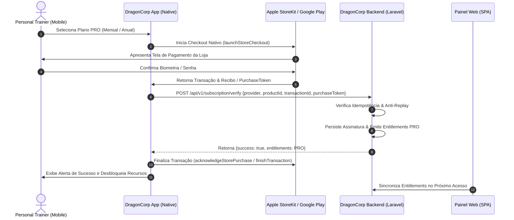

# Arquitetura de Faturamento & Assinaturas In-App (IAP) — DragonCorp

Este documento documenta o ciclo de vida, catálogo oficial, fluxo seguro de validação server-side, idempotência, webhooks e procedimentos de restauração de compras no **DragonCorp**.

---

## 1. Classificação de Produtos e Regras de Negócio

### 1.1 Assinatura Digital DragonCorp PRO (SaaS)
* **Objetivo:** Desbloqueia ferramentas digitais avançadas para Personal Trainers (Alunos ilimitados, Prescrição com IA, Avaliações Físicas Completas, Laudos PDF, Personalização de Marca e Acesso ao Painel Web).
* **Meio de Pagamento Exigido pelas Lojas:**
  * **iOS:** In-App Purchase (StoreKit) via Apple ID.
  * **Android:** Google Play Billing v5+ via Google Play Account.
* **Política:** Em conformidade com Apple Guideline 3.1.1 e Google Play Developer Policy.

### 1.2 Serviços e Consultorias Presenciais / Individuais
* O aplicativo **não** realiza intermediação financeira direta entre o Personal e o Aluno nesta versão 1.0. O Personal Trainer cadastra seus alunos no app como parte de sua consultoria, e o aluno tem acesso aos treinos concedido pela conta do treinador sem cobrança de taxa in-app.

---

## 2. Catálogo Oficial de Planos & Product IDs

O catálogo é centralizado de forma tipada em [`services/subscription-store-config.ts`](file:///Users/pumapunku/Documents/GitHub/Indigo-Aplicativo/services/subscription-store-config.ts).

```typescript
export const OFFICIAL_STORE_PRODUCTS = {
  monthly: {
    id: "personal_pro_monthly",
    appleProductId: "com.dragoncorp.pro.monthly",
    googleProductId: "dragoncorp_pro_monthly",
    plan: "PRO",
    billingPeriod: "monthly",
    referencePrice: 19.90,
    currency: "BRL",
    localizedPrice: "R$ 19,90/mês",
    title: "Plano Pro Mensal",
    trialDays: 7,
  },
  annual: {
    id: "personal_pro_annual",
    appleProductId: "com.dragoncorp.pro.annual",
    googleProductId: "dragoncorp_pro_annual",
    plan: "PRO",
    billingPeriod: "annual",
    referencePrice: 199.00,
    currency: "BRL",
    localizedPrice: "R$ 199,00/ano",
    title: "Plano Pro Anual (2 Meses Grátis)",
    trialDays: 7,
  },
};
```

---

## 3. Fluxo de Compra e Validação com Idempotência



---

## 4. Validação Server-Side (Fonte Única da Verdade)

O backend Laravel implementa a validação em [`SubscriptionVerificationService.php`](file:///Users/pumapunku/Documents/GitHub/Indigo-Aplicativo/web/backend/app/Services/SubscriptionVerificationService.php):

1. **Autorização Rígida de Papéis:** Somente usuários com `role === 'TRAINER'` ou `role === 'SUPER_ADMIN'` podem ter assinaturas PRO ativadas.
2. **Idempotência de Transação:** O banco armazena cada `transaction_id`. Se a mesma transação for enviada novamente pela mesma conta, retorna sucesso idempotente sem duplicar registros ou alterar datas indevidamente.
3. **Prevenção de Roubo de Recibo (Anti-Replay):** Se um `original_transaction_id` já pertencer a outro usuário, o backend bloqueia a ativação com erro 422 e registra uma tentativa suspeita na tabela de auditoria (`AuditLog`).
4. **Mascaramento de Tokens em Logs:** Tokens de compra e recibos nunca são impressos na íntegra nos logs do servidor.

---

## 5. Webhooks de Notificação das Lojas (Server-to-Server)

O backend disponibiliza endpoints dedicados para eventos em tempo real:

* **Apple App Store Server Notifications V2:**
  * Endpoint: `POST /api/v1/webhooks/apple-iap`
  * Eventos Tratados: `DID_RENEW` (renovação automática), `EXPIRED` (expiração), `DID_FAIL_TO_RENEW` (período de tolerância / tentativa de cobrança), `REFUND` (reembolso), `REVOKE` (revogação de acesso).
* **Google Play Real-Time Developer Notifications (RTDN via Cloud Pub/Sub):**
  * Endpoint: `POST /api/v1/webhooks/google-play`
  * Eventos Tratados: Tipo 2 (Renovada), Tipo 3 (Cancelada), Tipo 12 (Revogada), Tipo 13 (Expirada).

---

## 6. Fluxo de Restauração de Compras (Restore Purchases)

Disponível no cabeçalho e rodapé da tela de assinaturas ([`app/subscription.tsx`](file:///Users/pumapunku/Documents/GitHub/Indigo-Aplicativo/app/subscription.tsx)):

1. Chama `getActiveStorePurchases()` para consultar transações ativas na conta da Apple ID / Google Play conectada ao aparelho.
2. Envia os recibos ao backend via `POST /api/v1/subscription/restore`.
3. O backend valida a titularidade e vigência, restabelece os entitlements PRO na conta e sincroniza a persistência local.
4. Se nenhuma compra ativa for encontrada, emite mensagem amigável sem lançar erros críticos.
