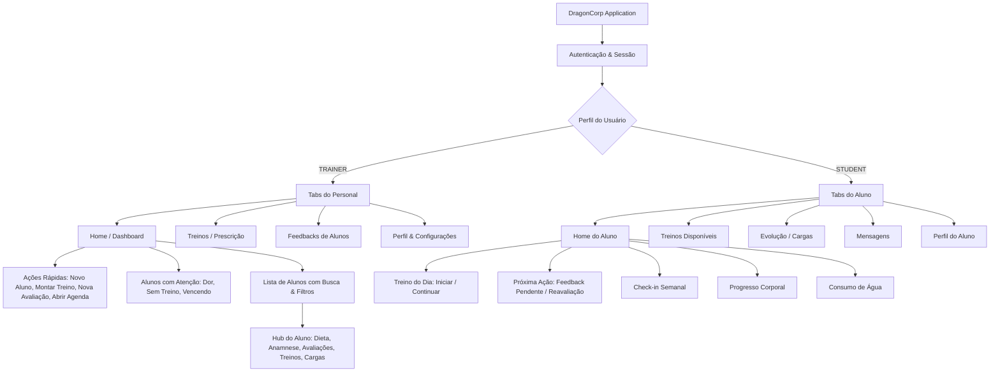

# Arquitetura de Informação — DragonCorp

Data: 06/10/2026  
Versão: 2.0 (UX Otimizada)  

---

## 1. Visão Geral da Arquitetura

A arquitetura de informação do DragonCorp foi redesenhada para garantir que tarefas frequentes sejam executadas com o menor número de toques e máxima clareza cognitiva, mantendo recursos analíticos e administrativos organizados em contextos adequados.

---

## 2. Navegação do Personal Trainer

### Barra Inferior (Tab Navigation)
1. **Home (`/index`):** Resumo diário, pendências críticas, ações rápidas prioritárias, alertas de alunos com dor e lista completa de alunos.
2. **Treinos (`/training`):** Biblioteca de sessões, prescrição por fases, agrupamentos bi-set/tri-set, carga planejada e templates.
3. **Feedback (`/feedbacks`):** Central de respostas a feedbacks e percepções de esforço (RPE) dos alunos.
4. **Perfil (`/profile`):** Identidade visual da consultoria (logo e cores), credenciais, gestão de assinatura e atalhos de ferramentas.

### Hub do Aluno (`/profile?studentId=...`)
Ponto central de todas as operações contextuais do aluno:
- **Dados Cadastrais & Contato** (com botão rápido de WhatsApp)
- **Dieta & Nutrição** (`/student-diet`)
- **Anamnese** (`/trainer-anamnesis`)
- **Avaliações Físicas** (`/assessment-editor` / `/assessment-detail`)
- **Treinos do Aluno** (`/training?studentId=...`)
- **Evolução de Cargas** (`/exercise-performance?studentId=...`)
- **Credenciais & Link de Acesso**

---

## 3. Navegação do Aluno

### Barra Inferior (Tab Navigation)
1. **Home (`/student`):**
   - **Hero:** Treino do dia liberado com botão de 1 toque *"Iniciar Treino"*.
   - **Próxima Ação:** Feedback de treino pendente ou nova avaliação.
   - **Acompanhamento Semanal:** Consistência e check-in diário.
   - **Evolução Recente:** Peso e composição.
   - **Protocolo Aeróbio:** Teste Conconi e orientações de cardio.
   - **Hidratação:** Meta diária de água.
2. **Treinos (`/training`):** Planilhas ativas e histórico de execuções passadas.
3. **Evolução (`/evolution`):** Gráficos de recordes de carga, volume semanal e medidas corporais.
4. **Mensagens (`/messages`):** Chat direto com o treinador.
5. **Perfil (`/profile`):** Dados pessoais, metas, configurações e suporte.

---

## 4. Matriz Completa de Inventário de Funcionalidades

| Perfil | Funcionalidade | Entrada Atual | Frequência | Importância | Problema Anterior | Nova Entrada Otimizada |
|---|---|---|---|---|---|---|
| **Aluno** | Iniciar Treino do Dia | Card secundário inferior | Alta (Diária) | **Primária** | Escondido sob outros banners | Hero Card no topo da Home |
| **Aluno** | Registrar Séries & Cargas | `/training-details` | Alta (Diária) | **Primária** | Muitos botões concorrentes | Fluxo de execução com séries claras e carga anterior de referência |
| **Aluno** | Check-in Semanal | Home (meio da página) | Alta (Diária) | **Primária** | Competia com início de treino | Integrado logo após o treino de hoje |
| **Aluno** | Enviar Feedback de Treino | Mini card / Aba feedbacks | Média | **Contextual** | Aluno esquecia de relatar | Card de "Próxima Ação" quando houver treino concluído sem relato |
| **Aluno** | Acompanhar Evolução de Peso | Banner no topo | Média | **Secundária** | Ocupava o topo indevidamente | Seção "Evolução Recente" com gráfico e meta |
| **Aluno** | Protocolo Aeróbio Conconi | Home inferior | Baixa (Semanal) | **Contextual** | Sem destaque quando ativo | Card ativo com regra (2 sem / 2x cada treino) e modal explicativo |
| **Aluno** | Consumo de Água | Home inferior | Alta (Diária) | **Secundária** | - | Card de hidratação rápido com atalho para tela completa |
| **Personal** | Cadastrar Novo Aluno | Atalho genérico / Modal | Média | **Primária** | Misturado com dezenas de botões | Botão de Ação Rápida prioritária #1 na Home |
| **Personal** | Montar Treino | Aba Treinos ou perfil | Alta (Diária) | **Primária** | Exigia múltiplos cliques | Botão de Ação Rápida #2 + atalho direto dentro do perfil do aluno |
| **Personal** | Criar Avaliação Física | Perfil do aluno / menu | Média | **Primária** | Fluxo longo de localização | Botão de Ação Rápida #3 + atalho contextual dentro do perfil do aluno |
| **Personal** | Abrir Agenda | Menu secundário | Alta (Diária) | **Primária** | Pouco visível | Botão de Ação Rápida #4 na Home |
| **Personal** | Identificar Alunos com Dor | Rolagem de lista | Alta (Diária) | **Primária** | Dores passavam despercebidas | Seção "Alunos que precisam de atenção" no topo |
| **Personal** | Responder Feedback | Aba Feedbacks / Pendências | Alta (Diária) | **Primária** | Alertas misturados | Seção Pendências e aba de Feedback com badge em tempo real |
| **Personal** | Teste Aeróbio (Conconi) | Banner gigante no topo | Baixa | **Secundária** | Poluía a Home diária | Realocado para seção "Mais ferramentas" |
| **Personal** | Personalizar Consultoria | Perfil do Treinador | Baixa | **Administrativa** | - | Centralizado na aba Perfil com branding em tempo real |
| **Personal** | Assinatura e Planos | Perfil / Paywall | Baixa | **Administrativa** | - | Aba Perfil e verificação transparente de limites |
