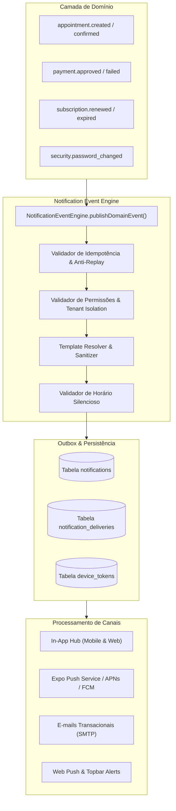

# Arquitetura Central de Notificações — Reservei & DragonCorp

Este documento descreve a arquitetura técnica, fluxo orientado a eventos, modelo de outbox/fila transacional, ciclo de vida de tokens, idempotência e isolamento multiempresa do sistema de notificações.

---

## 1. Visão Geral da Arquitetura

O sistema adota uma arquitetura desacoplada e orientada a eventos de domínio (**Event-Driven Architecture**), garantindo que operações críticas de agendamento, faturamento e segurança nunca sejam bloqueadas por requisições síncronas a provedores externos de push ou e-mail.



---

## 2. Padrão Transactional Outbox & Idempotência

1. **Transactional Outbox:** Ao registrar um agendamento ou pagamento, o evento correspondente é registrado atômica e localmente. Isso impede que uma falha de conexão com a Apple ou Google perca a notificação.
2. **Chaves Idempotentes Determinísticas:** O sistema gera chaves no formato:
   ```text
   appointment:{appointmentId}:{eventType}:{recipientId}
   appointment:{appointmentId}:reminder:{interval}:{recipientId}
   payment:{paymentId}:{eventType}:{recipientId}
   ```
3. **Prevenção de Duplicidade:** O processador verifica a existência da chave antes de qualquer envio.

---

## 3. Matriz de Perfis e Permissões (RBAC)

* **CLIENT (Cliente / Aluno):** Recebe apenas avisos sobre seus próprios agendamentos, pagamentos, lembretes de atendimento e alertas de segurança. Nunca tem acesso a faturamento de terceiros ou dados operacionais.
* **PROFESSIONAL (Profissional / Personal):** Recebe alertas de novos agendamentos, reagendamentos, cancelamentos de seus clientes, relatos de dor/feedbacks e lembretes da sua agenda.
* **MANAGER / ADMIN (Gestor / Proprietário):** Recebe resumos diários, fechamentos financeiros, alertas de assinatura da empresa e convites de equipe.
* **SUPER_ADMIN:** Acesso exclusivo à observabilidade e métricas agregadas da plataforma sem violação de privacidade de dados sensíveis.

---

## 4. Gerenciamento de Horário Silencioso (*Quiet Hours*) & Fusos

* **Horário Silencioso Padrão:** 22:00 às 07:00 (configurável pelo usuário).
* **Regra de Supressão:** Notificações informativas e de marketing são automaticamente suprimidas ou postergadas durante o horário silencioso.
* **Exceção de Segurança & Urgência:** Alertas de segurança da conta (`security.*`) e alterações urgentes de atendimento furam o horário silencioso com prioridade máxima.
