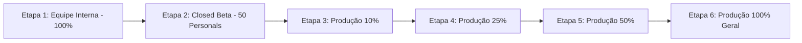

# Playbook de Rollout, Rollback e Monitoramento de Custos — DragonCorp

**Engenharia de Operações, Confiabilidade e Infraestrutura Mobile**  
**Data:** 28 de Agosto de 2026  

---

## 1. Estratégia de Lançamento Gradual (Staged Rollout)

### Etapa 1: Equipe Interna (Alpha)
* **Público:** Engenheiros, time de produto e QA (10 a 20 dispositivos iOS e Android).
* **Distribuição:** TestFlight Interno (iOS) e Faixa de Teste Interno no Google Play Console.
* **Objetivo:** Validar fluxos críticos, persistência de autenticação e ausência de crash no cold start.

### Etapa 2: Closed Beta (Grupo Fechado)
* **Público:** 50 Personal Trainers convidados com seus respectivos alunos reais.
* **Distribuição:** TestFlight Externo e Faixa Fechada (Closed Track) no Google Play.
* **Critério de Avanço:** 7 dias sem nenhum crash crítico ou falha de compra no Sandbox.

### Etapa 3: Rollout Gradual em Produção
* **Dia 1:** 10% dos usuários no Google Play e Liberação Gradual na App Store.
* **Dia 3:** 25% dos usuários (se métricas estiverem estáveis).
* **Dia 5:** 50% dos usuários.
* **Dia 7:** 100% de distribuição pública.

---

## 2. Métricas de SLA e Critérios de Interrupção / Rollback

| Métrica | Limite Aceitável | Limite de Alerta (Pausar Rollout) | Limite Crítico (Rollback Imediato) |
| :--- | :--- | :--- | :--- |
| **Crash-Free Users** | ≥ 99.5% | < 99.0% | < 98.0% |
| **Taxa de ANR (Android)** | ≤ 0.40% | > 0.45% | > 0.60% |
| **Falha em Pagamentos / IAP** | ≤ 0.10% | > 0.50% | > 1.00% |
| **Tempo de Resposta de APIs** | p95 < 800ms | p95 > 1.500ms | p95 > 3.000ms |
| **Erros 5xx de Backend** | ≤ 0.05% | > 0.20% | > 1.00% |

### Procedimento de Rollback de Emergência
1. **Pausar Rollout:** Interromper imediatamente o percentual de distribuição no Google Play Console e no App Store Connect.
2. **Reversão de Build:** Se o problema for incompatibilidade grave de dados, lançar hotfix com o commit estável anterior incrementando o `versionCode` / `buildNumber`.
3. **Comunicação aos Usuários:** Publicar banner informativo de manutenção se os serviços de backend exigirem mitigação.

---

## 3. Matriz de Custos de Infraestrutura e Serviços

| Serviço / Componente | Fornecedor | Plano / Modelo | Limite Gratuito / Custo Base | Alerta de Custo | Responsável |
| :--- | :--- | :--- | :--- | :--- | :--- |
| **Apple Developer Program** | Apple Inc. | Organização Anual | US$ 99 / ano | 30 dias antes do vencimento | Financeiro |
| **Google Play Developer** | Google LLC | Taxa Única | US$ 25 (vitalício) | N/A | Financeiro |
| **Hospedagem & CDN Web** | Vercel / Cloudflare | Pro / Business | US$ 20 / mês | Consumo acima de 80% de tráfego | Infraestrutura |
| **Banco de Dados & Auth** | Supabase / PostgreSQL | Pro Tier | US$ 25 / mês | CPU > 75% ou Storage > 80% | Backend Lead |
| **Armazenamento de Imagens** | Cloudflare R2 / AWS S3 | Pay-as-you-go | US$ 0,015 / GB | Gastos > US$ 50 / mês | Backend Lead |
| **Envio Transacional E-mail** | Resend / Amazon SES | Produção | US$ 0,10 / 1.000 e-mails | Rejeição (Bounce) > 2% | Infraestrutura |
| **SMS OTP (Login)** | Twilio / Zenvia | Pay-per-SMS | R$ 0,08 / SMS | Volume diário > 500 SMS | Segurança |
| **Push Notifications** | Expo Push / APNs / FCM | Gratuito | Ilimitado | Falha de entrega > 5% | Mobile Lead |
| **Monitoramento de Erros** | Sentry | Team Tier | US$ 26 / mês | Gastos acima de 50.000 eventos | Mobile Lead |

---

## 4. Políticas de Prevenção de Abuso e Rate Limiting

* **SMS OTP:** Máximo de 3 tentativas a cada 10 minutos por número de telefone. Bloqueio automático de IP por 1 hora após 5 falhas consecutivas.
* **Upload de Imagens:** Limite de 5 MB por foto na galeria, com compressão client-side em WebP (qualidade 0.85).
* **Chamados de Suporte:** Máximo de 5 chamados abertos simultâneos por usuário para evitar spam.
